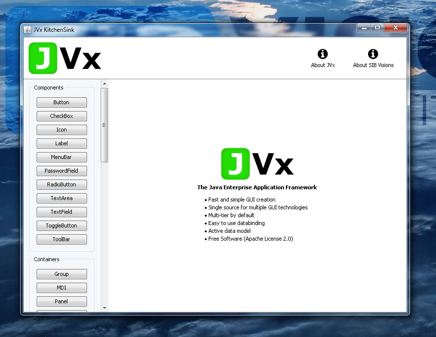
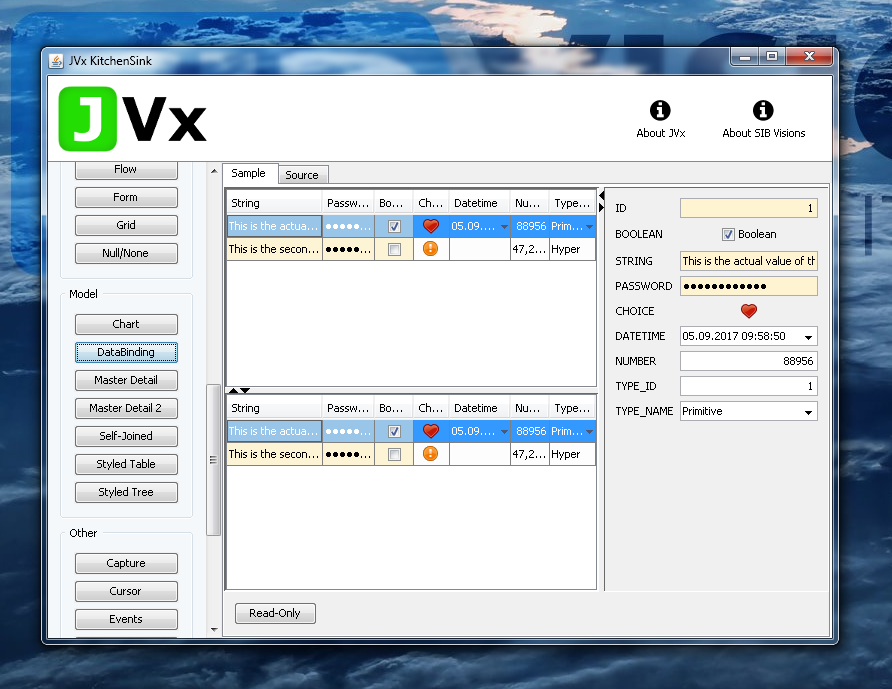
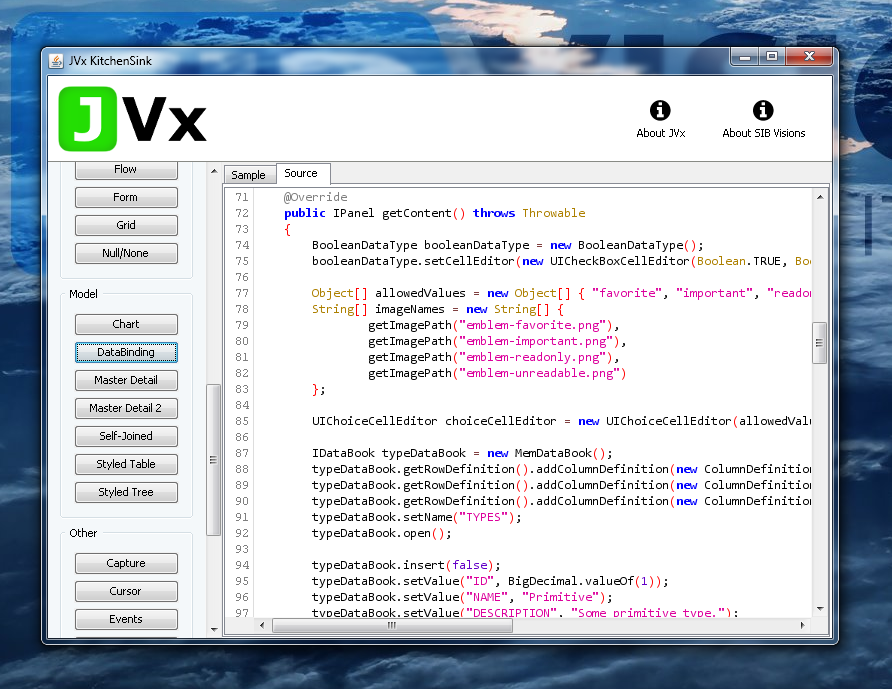

# jvx.kitchensink

The JVx Kitchensink application is a simple demo application that allows
to test and manipulate most controls, containers and concepts which are
available in the [JVx Enterprise Application Framework][JVx].

# Usage

Simply import the project into your [Eclipse][Eclipse] workspace and run it with
the provided launcher (`JVx KitchenSink*.launch`), or build the jar by running
[Ant][Ant] and start that manually.

Please note that Java version 1.8 is required for this sample application to
build and run, however, JVx itself only requires 1.6 to work.

By default the Swing factory (`com.sibvisions.rad.ui.swing.impl.SwingFactory`)
is created and used, to use another factory simply pass the fully qualified
name of the factory to the main method as argument, e.g.

    java -cp jvx.jar;jvxfx.jar;... -jar jvx-kitchensink.jar com.sibvisions.rad.ui.javafx.impl.FXFactory

 [Ant]: http://ant.apache.org/
 [JVx]: http://jvx.sibvisions.com
 [Eclipse]: https://www.eclipse.org/